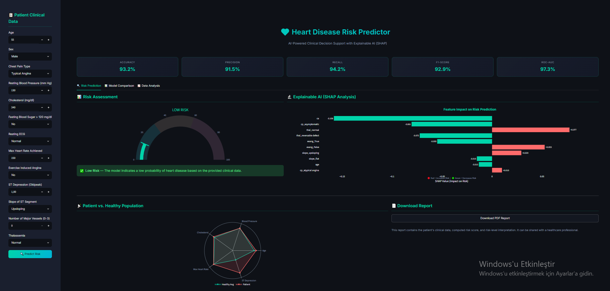
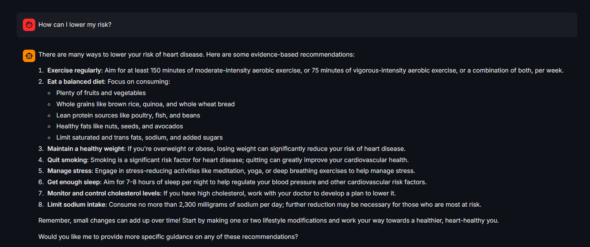
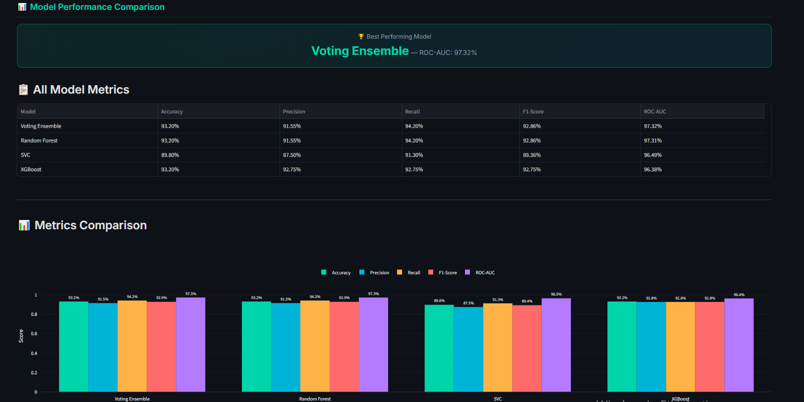
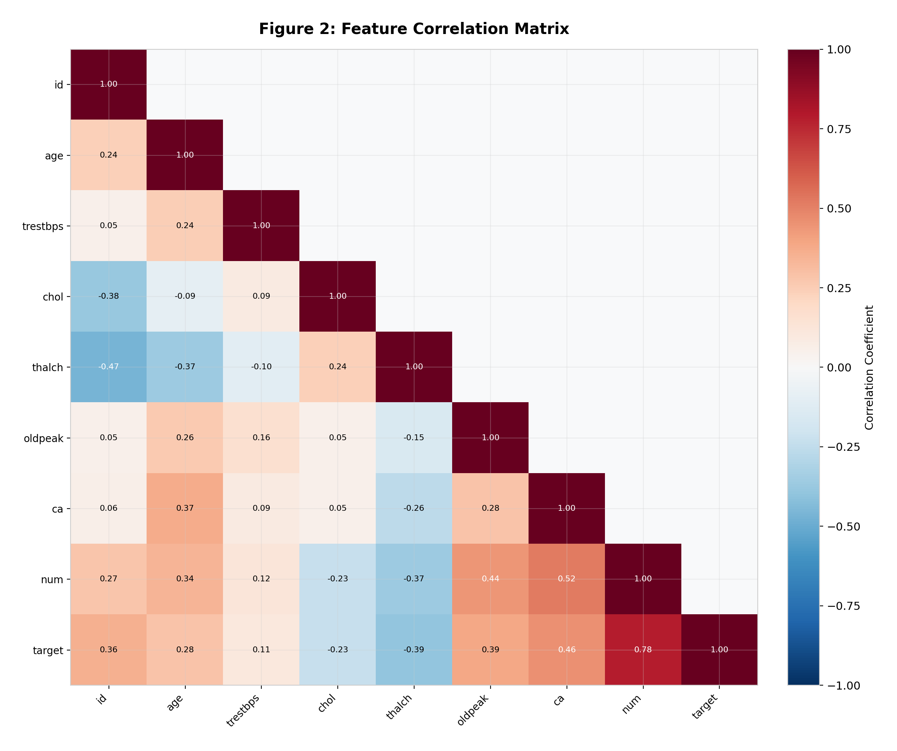

# Heart Disease Risk Prediction Application

A comprehensive Clinical Decision Support System (CDSS) for predicting heart disease risk based on patient clinical data. This project combines thorough Exploratory Data Analysis (EDA), ensemble machine learning models, Explainable AI (SHAP), and an interactive Large Language Model (LLaMA) powered medical assistant into a unified Streamlit web application.

## Overview

Initially conceived as an Exploratory Data Analysis and baseline modeling project, the scope was significantly expanded to prioritize clinical utility and interpretability. Machine learning models in healthcare often suffer from a "black-box" reputation; to address this, we integrated SHAP (SHapley Additive exPlanations) to transparently show how each patient feature contributes to the final risk score. 

## Application Interface & Visualizations

### 1. Risk Prediction & Explainable AI (SHAP)

*The main dashboard allows users to input clinical parameters. The AI immediately calculates a risk score displayed on a dynamic gauge. On the right, the **SHAP analysis** breaks down exactly which factors (e.g., maximum heart rate, chest pain type) increased or decreased the risk, providing full transparency to the doctor.*

### 2. AI Medical Assistant (Chatbot)

*To assist patients and healthcare providers further, a locally hosted **LLaMA 3.2** model acts as an intelligent medical assistant. It analyzes the patient's specific inputs and risk score to provide personalized, natural language answers about cardiovascular health.*

### 3. Model Comparison Dashboard

*Transparency isn't limited to predictions. The web app includes a dashboard comparing the performances of our four trained models (Random Forest, XGBoost, SVC, and the Voting Ensemble), displaying key metrics like ROC-AUC and Accuracy to establish clinical trust.*

### 4. Exploratory Data Analysis (EDA)

*Before training any models, extensive EDA was performed. This correlation heatmap was vital in identifying multicollinearity and understanding which clinical parameters have the strongest direct relationships with heart disease.*

## Key Features

- **Exploratory Data Analysis (EDA)**: In-depth statistical analysis, outlier detection, and data visualization. Missing values were robustly handled using Random Forest-based Iterative Imputation.
- **Ensemble Machine Learning**: The predictive engine utilizes a Soft Voting Ensemble combining Random Forest, XGBoost, and Support Vector Classifier (SVC). The final model achieves a strong diagnostic performance (Accuracy: 93.2%, ROC-AUC: 97.3%).
- **Interactive Patient Dashboard**: A dynamic Streamlit interface allowing for real-time risk assessment, featuring intuitive Risk Gauges and Radar Charts that compare patient vitals against healthy population averages.
- **Explainable AI (SHAP)**: Feature-level impact visualizations are generated for every prediction, explaining exactly why a patient was classified into a specific risk category.
- **AI Medical Assistant**: An integrated context-aware chatbot powered by the LLaMA 3.2 model (running locally via Ollama).
- **Automated Medical Reporting**: One-click generation of professional PDF reports summarizing the clinical data and the AI's risk assessment.

## Project Structure

- `app.py`: The main Streamlit web application script encompassing the UI, model inference, SHAP visualizer, and Chatbot logic.
- `train_model.py`: The data preprocessing and machine learning pipeline used to train, evaluate, and serialize the models.
- `generate_thesis_figures.py`: A utility script for generating high-resolution EDA and model performance figures.
- `artifacts/`: Directory storing the trained serialized models, preprocessors, and evaluation metrics (`model.pkl`, `preprocessor.pkl`, etc.).
- `thesis_figures/`: Contains the generated plots and UI screenshots used in the project documentation.
- `data/`: Contains the dataset used for training (`heart_disease_uci.csv`).

## Installation and Setup

### Prerequisites
- Python 3.9+
- [Ollama](https://ollama.com/) (Required for the local LLaMA 3.2 Chatbot)

### Setup Instructions

1. Clone the repository:
   ```bash
   git clone https://github.com/[YOUR-USERNAME]/heart-disease-prediction-app.git
   cd heart-disease-prediction-app
   ```

2. Create a virtual environment and install dependencies:
   ```bash
   python -m venv .venv
   source .venv/bin/activate  # On Windows use: .venv\Scripts\activate
   pip install -r requirements.txt
   ```

3. Ensure Ollama is running in the background and pull the required model:
   ```bash
   ollama pull llama3.2
   ```

4. Run the model training pipeline (if you wish to retrain the models):
   ```bash
   python train_model.py
   ```

5. Launch the Streamlit application:
   ```bash
   streamlit run app.py
   ```

## Technologies Used

- **Data Processing**: Pandas, NumPy, Scikit-Learn
- **Machine Learning**: XGBoost, Scikit-Learn (Random Forest, SVC, Voting Classifier)
- **Explainability**: SHAP
- **Web Interface**: Streamlit, Plotly
- **Large Language Model**: LLaMA 3.2 (via Ollama)
- **PDF Report Generation**: FPDF (A Python library used to automatically generate and format the downloadable patient medical reports directly from the web interface).

## Contributing

Contributions, issues, and feature requests are welcome. Feel free to check the issues page.
